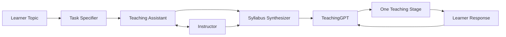
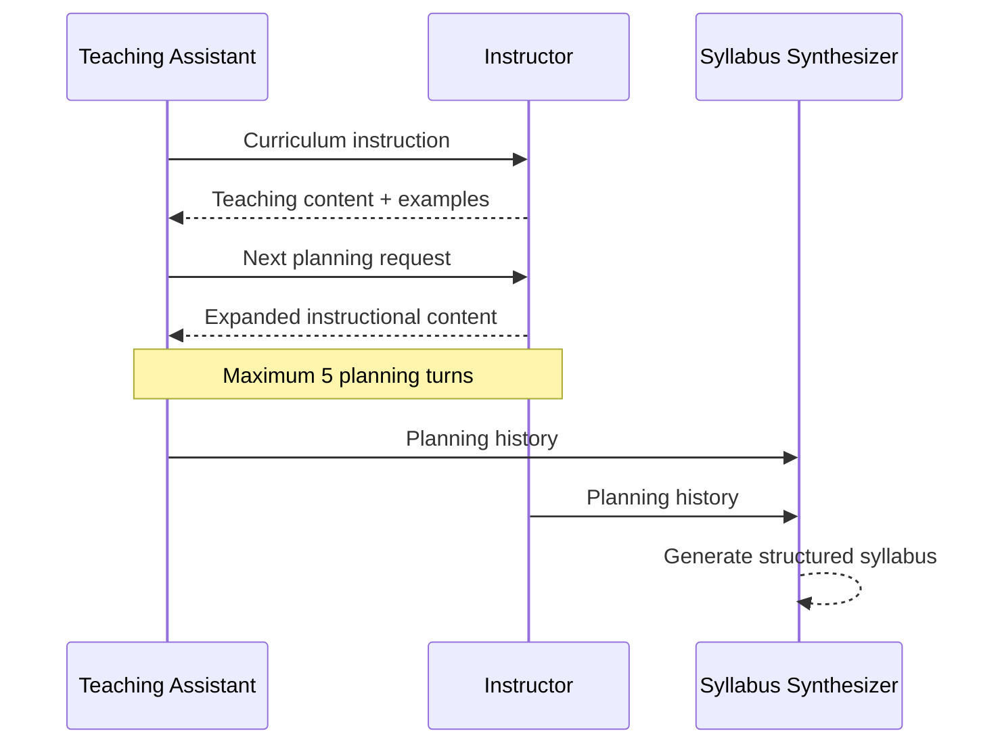

<div align="center">


### AI agents that plan a curriculum together — then a stateful instructor teaches it one stage at a time.

<p>


</p>

[](https://www.python.org/)
[](https://www.langchain.com/)
[](https://openai.com/)
[](https://www.gradio.app/)

**Multi-Agent Systems · LLM Orchestration · Stateful AI · Curriculum Planning · Conversational AI**

</div>

---

## ✨ LearnFlow in one glance

<table>
<tr>
<td width="25%" align="center">
<b>🎯 Refine</b><br/><br/>
<sub>Turn a broad learning request into a focused instructional objective.</sub>
</td>
<td width="25%" align="center">
<b>🤝 Plan</b><br/><br/>
<sub>Instructor and Teaching Assistant agents collaborate on curriculum structure.</sub>
</td>
<td width="25%" align="center">
<b>🧩 Synthesize</b><br/><br/>
<sub>A dedicated agent converts the planning dialogue into a syllabus.</sub>
</td>
<td width="25%" align="center">
<b>🧑‍🏫 Teach</b><br/><br/>
<sub>A stateful instructor follows the syllabus using conversation context.</sub>
</td>
</tr>
</table>

LearnFlow AI separates **planning what to teach** from **executing how to teach it**.

---

## 🚀 Learning flow



<div align="center">

`TOPIC` → `REFINE` → `COLLABORATE` → `BUILD SYLLABUS` → `TEACH` → `LEARNER FEEDBACK`

</div>

---

## 🤖 Meet the AI team

| Component | Responsibility | Output |
|---|---|---|
| **🎯 Task Specifier** | Refines the learner's request | Focused teaching objective |
| **🧑‍💻 Teaching Assistant** | Decomposes the objective into curriculum requests | Planning instructions |
| **👨‍🏫 Instructor** | Produces instructional material and examples | Teaching content |
| **🧩 Syllabus Synthesizer** | Compresses the planning exchange | Structured syllabus |
| **🧠 TeachingGPT** | Maintains syllabus, topic, and conversation state | Next learner-facing stage |

Agent collaboration is intentionally bounded to **5 planning turns**, preventing an uncontrolled agent-to-agent loop.

---

## 🧠 What makes it more than a chatbot?

<table>
<tr>
<td width="33%" valign="top">

### 🧭 Syllabus-guided
The instructor follows the generated syllabus in order instead of treating every message as an isolated prompt.

</td>
<td width="33%" valign="top">

### 💾 Stateful
`TeachingGPT` carries the syllabus, teaching objective, and accumulated conversation history between turns.

</td>
<td width="33%" valign="top">

### 🧑‍🤝‍🧑 Human-controlled
Each instructional stage ends with `<END_OF_TURN>`, giving control back to the learner before the system continues.

</td>
</tr>
</table>

---

## ⚙️ Under the hood

### Multi-agent curriculum planning



### Stateful teaching controller

Every teaching turn is conditioned on:

```text
Generated syllabus
        +
Teaching objective
        +
Learner / instructor conversation history
        ↓
Next syllabus-aligned teaching stage
```

The syllabus therefore acts as an **active runtime control input**, not just a one-time generated document.

---

## 🎨 Product experience

<table>
<tr>
<td width="50%" valign="top">

### 📚 Syllabus Builder

**1.** Enter a learning topic  
**2.** Run multi-agent curriculum planning  
**3.** Generate the syllabus  
**4.** Seed the teaching controller

</td>
<td width="50%" valign="top">

### 💬 AI Instructor

**1.** Start the lesson  
**2.** Receive one syllabus-aligned stage  
**3.** Ask questions or respond  
**4.** Continue with updated context

</td>
</tr>
</table>

---

## 🔬 Engineering signals

| Design choice | Why it matters |
|---|---|
| **Role-specific prompts** | Separates planning, instruction, synthesis, and teaching behavior |
| **Bounded agent loop** | Prevents unlimited agent-to-agent generation |
| **Explicit state handoff** | Carries the generated syllabus into runtime instruction |
| **Conversation memory** | Allows later teaching stages to respond to learner context |
| **Human turn boundary** | Avoids generating an entire course in one uninterrupted response |
| **Workflow / UI separation** | Keeps orchestration logic outside Gradio callbacks |

---

## 🛠️ Stack

<div align="center">

**Python 3.10+** · **LangChain** · **OpenAI Chat Models** · **Gradio Blocks** · **Pydantic** · **NumPy**

</div>

---

## 📁 Repository map

```text
LearnFlow-AI/
├── diagram.png
├── requirements.txt
├── setup.py
├── pyproject.toml
├── Makefile
│
└── src/
    ├── run.py                   # Gradio UI + workflow wiring
    ├── generating_syllabus.py  # Task refinement + multi-agent planning
    ├── teaching_agent.py       # Stateful TeachingGPT controller
    └── EduGPT.ipynb            # Original experimentation notebook
```

---

<details>
<summary><b>🧩 Prompt architecture</b></summary>

<br/>

| Prompt layer | Responsibility |
|---|---|
| **Task Specification** | Convert a broad learning request into a focused instructional objective |
| **Instructor Inception** | Define Instructor behavior during curriculum planning |
| **Teaching Assistant Inception** | Define curriculum-decomposition behavior |
| **Syllabus Synthesis** | Convert planning history into a course structure |
| **Teaching Instructor** | Follow syllabus order and conversation context during tutoring |

</details>

<details>
<summary><b>✅ Implemented in the current repository</b></summary>

<br/>

- topic-driven syllabus generation
- task-specification LLM stage
- role-based multi-agent curriculum planning
- bounded Instructor ↔ Teaching Assistant collaboration
- dedicated syllabus synthesis stage
- stateful `TeachingGPT` controller
- conversation-history-aware instruction
- one-stage-at-a-time lesson delivery
- `<END_OF_TURN>` learner handoff
- Gradio syllabus-builder interface
- Gradio conversational instructor
- character-by-character response rendering
- OpenAI quota error handling

</details>

<details>
<summary><b>🔭 Production evolution</b></summary>

<br/>

Natural next steps:

**Evaluation**
- structured syllabus schemas
- prompt regression tests
- curriculum-coverage checks
- model / agent evaluation datasets
- hallucination and failure analysis

**Grounding & personalization**
- RAG over textbooks, notes, and course material
- citations and source attribution
- learner profiles and mastery tracking
- adaptive difficulty

**Platform hardening**
- persistent session storage
- authenticated users
- tracing, latency, token, and cost metrics
- model fallback policies
- Docker + CI/CD

</details>

<details>
<summary><b>🚀 Run locally</b></summary>

<br/>

```bash
git clone https://github.com/Ankita2525/LearnFlow-AI.git
cd LearnFlow-AI

python3.10 -m venv .venv
source .venv/bin/activate

pip install -r requirements.txt
```

Create a `.env` file:

```env
OPENAI_API_KEY=your_openai_api_key
```

Run:

```bash
python src/run.py
```

</details>

---

## 💡 Why LearnFlow AI?

A generic chatbot answers the **next question**.

LearnFlow AI manages a **learning sequence**:

<div align="center">

`WHAT TO LEARN?` → `HOW TO ORGANIZE IT?` → `HOW TO TEACH IT?` → `WHAT DID THE LEARNER SAY?` → `WHAT HAPPENS NEXT?`

### Don't just answer the learner. **Orchestrate the learning flow.**

</div>

---

### Attribution

LearnFlow AI is an adapted and extended version of **EduGPT** by **Huynh Quynh Anh**.  
The original MIT license is retained in this repository. The legacy `EduGPT.ipynb` is preserved as the original experimentation notebook.

---

<div align="center">

**LearnFlow AI**

Multi-Agent Systems · LLM Orchestration · Conversational AI · Applied AI Engineering


</div>
