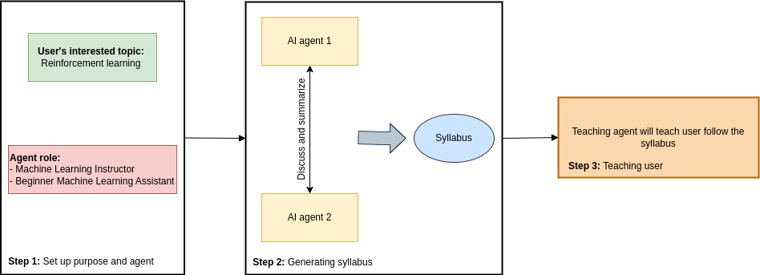

<div align="center">


AI agents that plan a curriculum together - then a stateful instructor teaches it one stage at a time.


Multi-Agent Systems · LLM Orchestration · Stateful AI · Curriculum Planning · Conversational AI · Human-in-the-Loop

</div>

## ✨ LearnFlow in one glance

<table>
<tr>
<td width="25%" align="center"><b>🎯 Refine</b><br><sub>Turns a broad topic into a focused learning objective</sub></td>
<td width="25%" align="center"><b>🤝 Plan</b><br><sub>Instructor + Teaching Assistant agents co-design the curriculum</sub></td>
<td width="25%" align="center"><b>🧩 Synthesize</b><br><sub>A dedicated agent converts the planning dialogue into a syllabus</sub></td>
<td width="25%" align="center"><b>🧑‍🏫 Teach</b><br><sub>A stateful instructor follows the syllabus using learner context</sub></td>
</tr>
</table>

LearnFlow AI separates planning what to teach from executing how to teach it.

🚀 The experience

Learner chooses a topic
        ↓
AI sharpens the learning objective
        ↓
Two specialist agents design the curriculum
        ↓
A synthesis agent creates the syllabus
        ↓
TeachingGPT takes over
        ↓
One lesson stage at a time
        ↓
Learner responds → context updates → teaching continues

```flowchart LR
    A[Topic] --> B[Task Specifier]
    B --> C[Teaching Assistant]
    C <--> D[Instructor]
    C --> E[Syllabus Synthesizer]
    D --> E
    E --> F[TeachingGPT]
    F --> G[Interactive Lesson]
    G --> H[Learner Feedback]
    H --> F```

🤖 Meet the AI team

Agent

Role

Output

🎯 Task Specifier

Removes ambiguity from the learner's request

Focused teaching objective

🧑‍💻 Teaching Assistant

Breaks the objective into curriculum requests

Structured planning instructions

👨‍🏫 Instructor

Produces detailed teaching material and examples

Instructional content

🧩 Syllabus Synthesizer

Compresses the planning exchange

Final course syllabus

🧠 TeachingGPT

Maintains syllabus + topic + conversation state

Next learner-facing teaching stage

The planning conversation is deliberately bounded to 5 turns, so agent collaboration stays controlled instead of running indefinitely.

🧠 What makes it more than a chatbot?

<table>
<tr>
<td width="33%" valign="top">
<b>🧭 Syllabus-guided execution</b><br><br>
The instructor follows the generated syllabus in order instead of answering each message independently.
</td>
<td width="33%" valign="top">
<b>💾 Explicit runtime state</b><br><br>
<code>TeachingGPT</code> owns the syllabus, teaching objective, and accumulated conversation history.
</td>
<td width="33%" valign="top">
<b>🧑‍🤝‍🧑 Human-in-the-loop</b><br><br>
Each teaching stage ends with <code>&lt;END_OF_TURN&gt;</code>, returning control to the learner before the lesson continues.
</td>
</tr>
</table>

⚙️ Under the hood

Multi-agent planning

```sequenceDiagram
    participant TA as Teaching Assistant
    participant IN as Instructor
    participant SY as Syllabus Synthesizer

    TA->>IN: Curriculum request
    IN-->>TA: Teaching content + examples
    TA->>IN: Next planning instruction
    IN-->>TA: Expanded content
    Note over TA,IN: Up to 5 collaboration turns
    TA->>SY: Full planning history
    IN->>SY: Full planning history
    SY-->>SY: Build final syllabus```

Stateful teaching

```class TeachingGPT(Chain, BaseModel):
    syllabus: str
    conversation_topic: str
    conversation_history: List[str]```

Every instructional turn is conditioned on:

Generated syllabus
      +
Teaching objective
      +
Learner / instructor history

That makes the generated syllabus an active control input for runtime teaching rather than a one-time piece of text.

🎨 Product flow

<table>
<tr>
<td width="50%" valign="top">

📚 Syllabus Builder

Enter a learning topic

Run multi-agent curriculum planning

Generate a structured syllabus

Seed the teaching controller

</td>
<td width="50%" valign="top">

💬 AI Instructor

Start the lesson

Receive one syllabus-aligned teaching stage

Ask questions or respond

Continue with updated conversation context

</td>
</tr>
</table>

<div align="center">
  
</div>

🔬 Engineering signals

Design choice

Why it matters

Role-specific system prompts

Separates planning, instruction, synthesis, and teaching behavior

Bounded agent loop

Prevents uncontrolled agent-to-agent generation

Explicit state handoff

Carries the generated syllabus into runtime instruction

Conversation memory

Keeps teaching responsive to learner follow-up questions

Human-controlled turn boundary

Avoids generating an entire course in one uninterrupted response

Workflow/UI separation

Keeps LLM orchestration in dedicated Python modules instead of mixing it into Gradio callbacks

User-facing API error handling

Converts OpenAI quota failures into readable application messages

🛠️ Stack

<div align="center">

AI / Orchestration

Application

State / Tooling

LangChain

Gradio Blocks

Pydantic

OpenAI Chat Models

Python 3.10+

In-memory conversation history

Custom DiscussAgent

Streaming chat UX

setuptools / Black / pre-commit

Custom LangChain Chain

Syllabus + instructor flows

Prompt templates

</div>

📁 Repository map
```
LearnFlow-AI/
├── diagram.png
├── requirements.txt
├── setup.py
├── pyproject.toml
├── Makefile
│
└── src/
    ├── run.py                  # Gradio app + workflow wiring
    ├── generating_syllabus.py # Task refinement + multi-agent planning
    ├── teaching_agent.py      # Stateful TeachingGPT controller
    └── EduGPT.ipynb           # Original experimentation notebook
    ```

<details>
<summary><b>🧩 Prompt architecture</b></summary>
<br>

LearnFlow uses separate prompt contracts instead of one generic system prompt:

Prompt

Responsibility

Task Specification

Convert the topic into a focused instructional objective

Instructor Inception

Define Instructor role and output behavior during planning

Teaching Assistant Inception

Define curriculum-decomposition behavior

Syllabus Synthesis

Convert planning history into a course structure

Teaching Instructor

Follow syllabus order and learner context during tutoring

</details>

<details>
<summary><b>✅ What is implemented</b></summary>
<br>

Topic-driven course generation

Task-specification LLM stage

Role-based multi-agent curriculum planning

Bounded Instructor ↔ Teaching Assistant collaboration

Dedicated syllabus synthesis stage

Stateful TeachingGPT controller

Conversation-history-aware instruction

Syllabus-order enforcement through prompt policy

One-stage-at-a-time teaching flow

<END_OF_TURN> human handoff

Gradio syllabus builder

Gradio conversational instructor

Character-by-character response streaming

OpenAI quota error handling

</details>

<details>
<summary><b>🧭 Production evolution</b></summary>
<br>

The current repository establishes the multi-agent curriculum + stateful tutoring core. Natural next steps include:

Reliability & evaluation

structured syllabus schemas

prompt regression tests

agent evaluation datasets

LLM-as-Judge scoring

curriculum-coverage checks

failure / hallucination analysis

Grounding & personalization

RAG over textbooks, notes, and course material

citations and source attribution

learner profiles and mastery tracking

adaptive difficulty

prerequisite detection

Platform hardening

persistent session storage

authenticated multi-user accounts

asynchronous generation jobs

tracing, latency, token, and cost metrics

model routing / fallback policies

containerized deployment and CI/CD

</details>

<details>
<summary><b>🚀 Run locally</b></summary>
<br>
```
git clone https://github.com/Ankita2525/LearnFlow-AI.git
cd LearnFlow-AI

python3.10 -m venv .venv
source .venv/bin/activate

pip install -r requirements.txt

Create a .env file:

OPENAI_API_KEY=your_openai_api_key

Then run:
```
python src/run.py

</details>

💡 Why LearnFlow AI?

A generic chatbot answers the next question.

LearnFlow AI manages a learning journey.

What should be taught?
        ↓
How should it be organized?
        ↓
How should it be delivered?
        ↓
What did the learner say?
        ↓
What should happen next?

Don't just answer the learner. Orchestrate the learning flow.

<div align="center">

Built by Ankita Khartmol

Multi-Agent Systems · LLM Orchestration · Conversational AI · Applied AI Engineering

</div>


