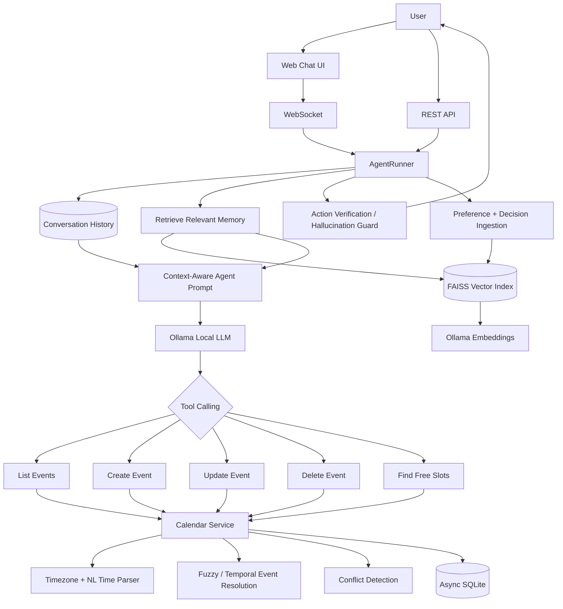
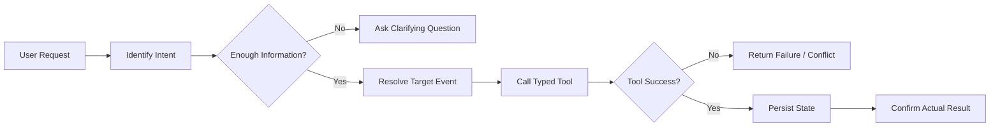
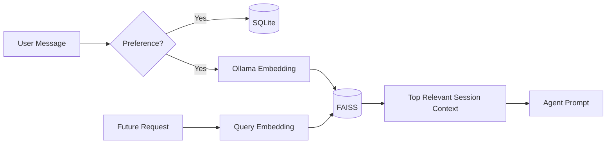
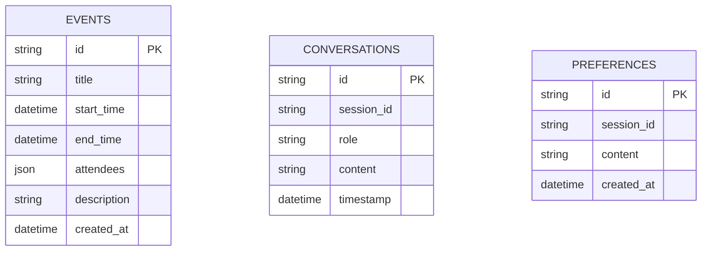

<div align="center">


### Natural-language scheduling powered by tool-calling agents, semantic memory, conflict detection, and real-time APIs.

[](https://www.python.org/)
[](https://fastapi.tiangolo.com/)
[](https://www.langchain.com/)
[](https://ollama.com/)
[](https://github.com/facebookresearch/faiss)
[](https://www.sqlite.org/)
[](https://developer.mozilla.org/en-US/docs/Web/API/WebSockets_API)
[](https://pytest.org/)

**Agentic AI · Tool Calling · RAG · Conversational AI · Vector Search · Async Python · Timezone-Aware Scheduling · LLM Guardrails**

</div>

---

## 🧠 What is SchedMate?

**SchedMate** is a local-first conversational scheduling agent designed to turn natural-language requests into reliable calendar actions.

Instead of treating scheduling as a simple chatbot task, SchedMate separates **LLM reasoning** from **deterministic calendar execution**. The language model interprets intent and chooses a tool; typed application code handles date parsing, event resolution, conflict detection, persistence, and free-slot calculation.

Users can say things like:

```text
"Schedule a design review tomorrow at 3 PM for 45 minutes."

"Move my 6 PM meeting to Friday."

"What meetings do I have this afternoon?"

"Find a free 30-minute slot tomorrow."

"Cancel today's standup."

"I prefer meetings after 11 AM."
```

SchedMate maintains conversational context, remembers relevant scheduling preferences through vector memory, and includes a guardrail that prevents the assistant from claiming an event was changed when no scheduling tool actually succeeded.

---

## ⚡ 30-second engineering overview

| Capability | Implementation |
|---|---|
| **Agentic scheduling** | LangChain tool-calling agent orchestrating 5 deterministic scheduling tools |
| **Local LLM inference** | Ollama-backed `ChatOllama`, configurable through environment settings |
| **Semantic memory / RAG** | Session-scoped preferences and scheduling decisions embedded with Ollama and indexed in FAISS |
| **Natural-language time understanding** | `dateparser` + `python-dateutil` + timezone-aware normalization |
| **Conflict-aware calendar engine** | Overlap detection, free-slot discovery, duration preservation, and event mutation |
| **Event resolution** | UUID lookup + fuzzy title matching + temporal fallback + nearest-time disambiguation |
| **Real-time interface** | FastAPI REST endpoints and persistent WebSocket chat sessions |
| **Persistence** | Async SQLite storage for events, conversation history, and user preferences |
| **Reliability controls** | Pydantic tool schemas, ambiguity rules, execution verification, hallucination guard |
| **Observability** | Structured JSON application logs with module, level, timestamp, and exception context |

---

# 🎯 Design goal

Scheduling assistants fail when the model is allowed to **invent state**.

SchedMate is built around a stronger contract:

> **The LLM decides what action should happen. Deterministic tools decide whether it actually can happen.**

That gives the system a clean separation between:

```text
Natural-language reasoning
        ↓
Structured tool invocation
        ↓
Validated scheduling logic
        ↓
Persistent calendar state
        ↓
Verified user-facing response
```

---

# 🏗️ System architecture



---

# 🤖 Agent workflow

The system prompt defines an explicit reasoning workflow for every scheduling request.



### Supported intents

| Intent | Examples | Tool |
|---|---|---|
| **Create** | schedule, book, add | `create_event` |
| **Update** | move, reschedule, rename, extend | `update_event` |
| **Delete** | cancel, remove | `delete_event` |
| **Query** | show my meetings, what's on today | `list_events` |
| **Search** | find free time, when am I available | `find_free_slots` |
| **Preference** | avoid mornings, prefer after 11 | semantic memory ingestion |

The agent is explicitly instructed to **ask instead of guess** when the request is ambiguous.

For example:

```text
"Reschedule it for 1 hour"
```

could mean:

- make the meeting one hour long, or
- move the meeting by one hour.

SchedMate's agent policy requires clarification before mutating calendar state.

---

# 🛠️ Deterministic scheduling tools

SchedMate exposes five typed LangChain tools.

### `create_event`

Creates an event with:

- title,
- start/end time,
- default or explicit duration,
- attendees,
- description.

Before persistence, the calendar checks for overlapping events.

### `update_event`

Supports changes to:

- title,
- start/end time,
- attendees,
- description.

If only the start time changes, the original event duration is preserved automatically.

### `delete_event`

Resolves an event by ID, fuzzy title, or temporal reference before deleting it.

### `list_events`

Returns events inside a requested time window.

### `find_free_slots`

Searches available windows inside the configured workday.

Current working-hours policy:

```text
09:00 → 18:00
```

---

# 🔎 Event resolution beyond exact matching

Real users rarely repeat exact calendar titles.

SchedMate therefore resolves event references in stages:

```text
UUID lookup
    ↓
Fuzzy title matching
    ↓
Temporal fallback
    ↓
Nearest-time disambiguation
```

Examples:

```text
"cancel design review"
"move today's meeting"
"change my 6pm meet"
"reschedule tomorrow's call"
```

Fuzzy matching uses `thefuzz`, while temporal references such as `today`, `tomorrow`, weekdays, and dayparts are converted into timezone-aware ranges.

This gives the tool layer a practical entity-resolution strategy instead of relying entirely on the LLM to identify the exact database record.

---

# 🌍 Timezone-aware natural-language scheduling

SchedMate normalizes natural language with:

- `dateparser`
- `python-dateutil`
- `pytz`

Supported styles include:

```text
tomorrow at 3pm
next Friday at 11
in 2 hours
this afternoon
Monday morning
2026-08-15T14:30:00
```

Internally, parsed times are stored as timezone-aware values.

Daypart mappings currently include:

```text
Morning    09:00 – 12:00
Afternoon  12:00 – 17:00
Evening    17:00 – 21:00
```

The default timezone is configurable and currently defaults to:

```text
America/Los_Angeles
```

---

# 🧠 Long-term scheduling memory with RAG

SchedMate detects preference-like statements such as:

```text
"I prefer meetings in the morning."
"Avoid meetings on Mondays."
"Never schedule before 9 AM."
"Keep meetings under 30 minutes."
```

When a preference is detected, it is stored in two places:

1. **SQLite** — durable preference record
2. **FAISS** — semantic representation for retrieval

The memory pipeline is:



Retrieval is scoped by `session_id`, helping isolate one conversation's remembered context from another.

Scheduling decisions can also be embedded as contextual memory for future recommendations.

---

# 🛡️ Guardrails against false actions

A scheduling agent should never tell a user:

```text
"Your meeting has been rescheduled."
```

unless the event was actually updated.

SchedMate therefore inspects the agent's intermediate tool steps after generation.

If the final LLM response claims a create/update/delete action succeeded **without a corresponding tool execution**, the response is replaced with a safe clarification message.

This creates a second reliability layer:

```text
LLM response
    +
Tool execution trace
    ↓
Consistency check
    ↓
Verified response
```

This is especially important for tool-using agents where natural-language confidence does not guarantee real state mutation.

---

# 💬 Real-time conversational interface

SchedMate exposes both REST and WebSocket interfaces.

### REST

```text
GET  /api/health
GET  /api/events
POST /api/chat
```

Example:

```json
POST /api/chat

{
  "session_id": "demo-user-1",
  "message": "Find a free 30-minute slot tomorrow",
  "timezone": "America/Los_Angeles"
}
```

### WebSocket

```text
/ws?session_id=<session>
```

The WebSocket layer:

- keeps a persistent conversation session,
- reuses the `AgentRunner`,
- accepts client timezone information,
- returns structured action metadata,
- reports processing errors without dropping application state.

The browser UI also persists the session ID locally and refreshes the event list after calendar mutations.

---

# 🗄️ Persistence model

SchedMate uses asynchronous SQLite access through `aiosqlite`.



Indexes are created for:

- event time ranges,
- conversation session + timestamp,
- preference session.

---

# ⚙️ Reliability and engineering choices

### Typed tool contracts

Every scheduling tool has a dedicated **Pydantic input schema**, giving the agent an explicit function contract.

### Async-first backend

FastAPI, WebSockets, SQLite calls, tools, agent execution, and memory operations all use asynchronous interfaces.

### Structured logging

The application emits compact JSON logs containing:

```text
timestamp
log level
module
message
exception context
```

This makes logs easier to aggregate and inspect than ad-hoc print statements.

### Session-scoped context

Conversation history and semantic memory are keyed by `session_id`.

### Conflict-aware writes

Create and time-changing update operations validate event overlap before committing.

### Local-first AI

The LLM and embedding models run through Ollama, allowing the current architecture to operate without sending scheduling conversations to a hosted model API.

---

# 🎨 Built-in web experience

The repository includes a responsive single-page scheduling interface with:

- real-time connection status,
- WebSocket chat,
- conversation bubbles,
- agent action indicators,
- live calendar sidebar,
- event detail modal,
- attendee display,
- responsive mobile layout,
- quick scheduling guidance.

The UI is intentionally lightweight so the engineering focus remains on the agent and orchestration layer.

---

# 🧪 Test coverage

The repository includes Pytest coverage for important deterministic behaviors.

### Calendar tests

- event creation,
- conflict detection,
- adjacent non-conflicting events,
- event listing,
- deletion,
- fuzzy event matching,
- free-slot discovery.

### Tool tests

- create-event tool execution,
- list-events tool execution,
- delete-event tool execution,
- free-slot tool execution.

### Time parsing tests

- ISO datetime parsing,
- relative dates,
- relative hours,
- invalid inputs,
- timezone awareness,
- daypart ranges,
- day boundaries,
- display formatting.

### Agent-memory tests

- preference detection patterns,
- rejection of ordinary scheduling requests as preferences.

---

# 📦 Technology stack

| Layer | Technology |
|---|---|
| **Language** | Python |
| **API framework** | FastAPI |
| **Real-time transport** | WebSockets |
| **Agent orchestration** | LangChain |
| **LLM runtime** | Ollama / ChatOllama |
| **Default LLM** | `llama3.1:8b` |
| **Embeddings** | Ollama `nomic-embed-text` |
| **Vector memory** | FAISS |
| **Persistence** | SQLite + `aiosqlite` |
| **Schema validation** | Pydantic |
| **Natural-language time parsing** | dateparser, python-dateutil |
| **Timezone handling** | pytz |
| **Fuzzy matching** | thefuzz |
| **Testing** | Pytest + pytest-asyncio |
| **Frontend** | HTML, CSS, vanilla JavaScript |

---

# 📁 Project structure

```text
Schdmate/
├── app/
│   ├── main.py
│   │
│   ├── api/
│   │   ├── routes.py              # REST API
│   │   └── websocket.py           # Real-time chat transport
│   │
│   ├── agent/
│   │   ├── agent.py               # AgentRunner + execution guard
│   │   ├── prompts.py             # Agent policy / reasoning rules
│   │   ├── tools.py               # Deterministic scheduling tools
│   │   └── schemas.py             # Pydantic tool contracts
│   │
│   ├── calendar/
│   │   └── mock_calendar.py       # SQLite-backed calendar abstraction
│   │
│   ├── rag/
│   │   ├── ingest.py              # Preference / decision ingestion
│   │   ├── memory_store.py        # FAISS + Ollama embeddings
│   │   └── retriever.py           # Session-scoped semantic retrieval
│   │
│   ├── storage/
│   │   ├── db.py                  # Async persistence
│   │   └── models.py              # Domain models
│   │
│   ├── core/
│   │   ├── config.py              # Environment-based settings
│   │   ├── logger.py              # JSON logging
│   │   └── time_utils.py          # NLP datetime utilities
│   │
│   └── static/
│       └── index.html              # Scheduling dashboard
│
├── tests/
│   ├── test_agent.py
│   ├── test_calendar.py
│   ├── test_tools.py
│   └── test_time_utils.py
│
├── faiss_index/
├── requirements.txt
└── pytest.ini
```

---

# 🚀 Run locally

## 1. Clone the repository

```bash
git clone https://github.com/Ankita2525/Schdmate.git
cd Schdmate
```

## 2. Create a virtual environment

```bash
python3 -m venv .venv
source .venv/bin/activate
```

On Windows:

```bash
.venv\Scripts\activate
```

## 3. Install dependencies

```bash
pip install -r requirements.txt
```

## 4. Install and start Ollama

Pull the models used by the current default configuration:

```bash
ollama pull llama3.1:8b
ollama pull nomic-embed-text
```

Start Ollama if it is not already running:

```bash
ollama serve
```

## 5. Optional environment configuration

Create `.env` in the repository root to override defaults:

```env
LLM_MODEL=llama3.1:8b
EMBEDDING_MODEL=nomic-embed-text
OLLAMA_BASE_URL=http://localhost:11434

DATABASE_PATH=./schedmate.db
FAISS_INDEX_PATH=./faiss_index

DEFAULT_TIMEZONE=America/Los_Angeles
LOG_LEVEL=INFO
```

## 6. Start SchedMate

```bash
uvicorn app.main:app --reload
```

Open:

```text
http://localhost:8000
```

Interactive FastAPI docs:

```text
http://localhost:8000/docs
```

---

# 🔌 Current implementation boundary

The current repository focuses on the **agent orchestration and scheduling intelligence layer**.

The calendar adapter is presently backed by local SQLite rather than a third-party calendar provider. This makes the core scheduling behavior reproducible and keeps external OAuth/provider complexity outside the agent logic.

That separation also creates a clean integration point for real providers.

---

# 🏭 Production evolution

The next stage of SchedMate can extend the existing core into a production scheduling service without changing the agent/tool contract.

### Calendar integrations

- Google Calendar API
- Microsoft Graph / Outlook
- provider-specific OAuth 2.0
- multi-calendar availability aggregation

### Platform architecture

- PostgreSQL for multi-user persistence
- Redis for ephemeral conversation/session state
- background jobs for reminders and calendar synchronization
- authenticated user/workspace model
- rate limiting and API quotas
- idempotency keys for calendar mutations

### Agent reliability

- confirmation policies for destructive actions
- structured agent traces
- tool-call latency/error metrics
- evaluation datasets for intent and tool selection
- prompt regression tests
- retrieval quality evaluation
- human-in-the-loop approval for sensitive actions

### Scheduling intelligence

- attendee availability negotiation
- recurring meetings
- travel/buffer time
- configurable working hours
- priority-aware optimization
- team preference modeling
- cross-timezone scheduling

### Deployment & operations

- containerization
- CI/CD
- health/readiness probes
- production observability
- secret management
- scalable vector persistence

---

# 💡 Why SchedMate?

The interesting part of scheduling is not generating a sentence like:

> “Sure, I scheduled that.”

The real problem is reliably connecting language to state:

```text
Intent
  +
Conversation context
  +
User preferences
  +
Time interpretation
  +
Entity resolution
  +
Conflict detection
  +
Verified tool execution
```

SchedMate treats those as separate engineering concerns and composes them into one conversational agent.

> **Natural language in. Verified calendar state out.**

---

<div align="center">

### Built by Ankita Khartmol

**Agentic AI · RAG · Backend Systems · Conversational AI**

</div>


